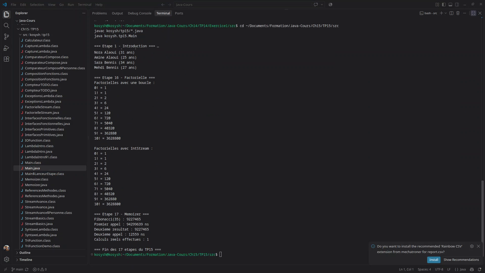

# TP15 Java

TP progressif en 17 etapes sur les expressions lambda et les streams.

## Contenu

- Interfaces fonctionnelles standard et primitives
- Syntaxes lambda et capture de variables
- References de methodes et API Stream
- Composition, validation et gestion des exceptions
- TriFunction, comparateurs, factorielle et memoisation

## Conclusion

Ce TP regroupe les principales utilisations des lambdas dans un seul projet Java.

## Demonstration

[Video de demonstration](Screen/video/TP15-demonstration.mp4)
